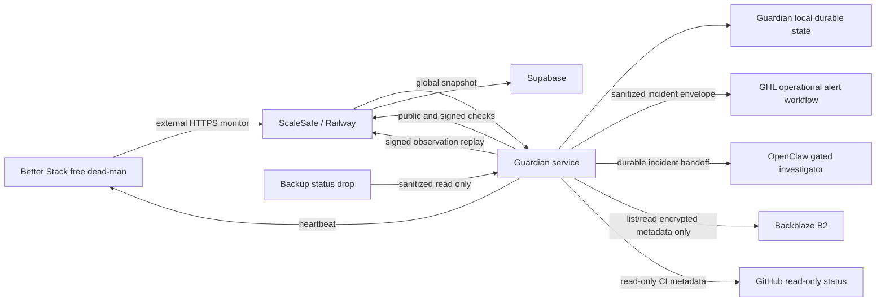

# Command Center Phase 3 Implementation And Certification

**Status:** Phase 3.0 and Phase 3.1 implementation are complete. Phase 3.2's
deterministic Guardian runner and isolated OpenClaw handoff are implemented,
installed disabled, and certified on the VPS. Guardian Protocol v1 is frozen
after independent review. Phase 3.3's sanitized recovery bridge at `d593820`
and Guardian release `8a4f1256cfaa9378764c730555608bd55e3c221d` are
installed disabled and passed live read-only recovery certification on the VPS.
The machine-readable proof is preserved under the locked Guardian account.
Migration 105 remains unapplied pending owner review. Phase 3.4 local preparation
is implemented on isolated feature branches and passes its local code gates.
External provider configuration, live alert certification, recurring timers,
production ingestion, deployment, and production activation have not begun and
are not authorized.

**Phase:** 3 - Guardian and independent alerting

**Depends on:** Phase 2 certification, migration 104, and explicit owner approval

**Production authorization:** None. This document does not authorize production SQL,
Railway changes, feature flags, deployment, merge, or push to `main`.

## 1. Purpose

Phase 2 lets ScaleSafe observe its own workers, queues, scheduled jobs, application
metrics, and incidents while the application and Supabase are available. Phase 3
adds an independent deterministic Guardian that can detect and report failures when
ScaleSafe, Supabase, or Railway cannot report for themselves.

The Guardian is a monitor and evidence source. It is not an administrator, repair
agent, deployment agent, payment operator, backup engine, restore engine, or
merchant-data service.

Phase 3 is complete only when all of the following are proven:

- The Guardian detects a real controlled outage.
- Critical alerts reach an independent provider.
- The owner can acknowledge an alert outside ScaleSafe.
- Detection, delivery, acknowledgement, and resolution survive ScaleSafe and
  Supabase being unavailable.
- Observations reconcile exactly once after recovery.
- A compromised Guardian service account cannot mutate payment, merchant,
  identity, authorization, deployment, backup, or restore state.
- Backup verification continues without exposing backup or decryption credentials.

## 2. Phase Boundary

### Included

- Signed Guardian ingestion and a sanitized read-only global snapshot endpoint.
- A least-privilege Guardian service on an always-on host.
- Global uptime, health, worker, queue, job, deployment, CI, security, backup, and
  restore-recency checks.
- Durable local Guardian state and an outbox that survives restarts.
- Independent incident notification, acknowledgement, dead-man monitoring, and
  delivery proof.
- Sanitized backup-status transfer from the existing backup service.
- Read-only, decryption-free inspection of encrypted backup objects.
- Machine-readable local reports for optional Hermes/OpenClaw summaries.

### Excluded

- Merchant payment, processor, dispute, or connector polling by Guardian.
- Any production repair, restart, rollback, deploy, restore, refund, cancellation,
  credential rotation, or data mutation.
- AI deciding whether an incident exists or whether it is resolved.
- A read-only production Postgres credential on Guardian.
- The Phase 4 operator dashboard.
- Reseller controls.
- Production activation before the Phase 3 certification gate passes.

## 3. Prerequisites And Stop Conditions

Implementation must not start until:

1. The corrected Phase 2 isolated soak has run continuously for at least 24 hours.
2. The Phase 2 final checker, complete logs, and database history pass.
3. The Phase 2 acceptance report records the final truthful result.
4. The isolated Phase 2 app is stopped only after proof is preserved.
5. The owner explicitly approves beginning Phase 3 implementation.
6. The next migration number is rechecked. This plan currently expects migration
   105, but it must not reuse a number added before implementation begins.
7. A live-schema comparison confirms production's actual migration state before
   any Phase 3 SQL is written.

Stop Phase 3 immediately if:

- A Phase 2 gate fails or the authoritative soak has a nonhealthy observation.
- The proposed Guardian service can access production mutation credentials.
- Independent alert delivery is not available.
- A migration or feature flag would need to be enabled before its isolated tests
  pass.
- Marketplace review would be disrupted.

## 4. Decisions Required Before Implementation

The following decisions remain owner-controlled.

### 4.1 Independent alert and investigation stack

**Approved controlled-beta stack:**

- Guardian performs deterministic checks on the existing VPS. OpenClaw command
  cron may schedule those checks without starting a model.
- Better Stack's free tier is used only for an external public monitor and the
  Guardian dead-man heartbeat. It provides the independent failure signal when the
  VPS itself cannot send an alert.
- A dedicated GHL inbound workflow receives only sanitized incident envelopes.
  It sends email for all routed incidents and adds SMS only for urgent or critical
  incidents.
- Guardian writes every incident to a local durable handoff queue. OpenClaw may
  invoke an affordable model only after deterministic code has opened an incident.
- Warning and informational incidents send email and enter the same handoff queue.
  Email is notification, not an authorization channel.
- No paid Better Stack responder, telemetry, or log-storage plan is required for
  controlled beta.

AI never decides whether a check failed or recovered. In Phase 3.4, OpenClaw
receives only the sanitized incident handoff, summarizes a probable cause, and
recommends the next check. It has no filesystem, browser, shell, provider, repair,
or patch tool. Deterministic Guardian code performs the read-only checks. A later
coding-agent control plane would require its own design and certification and
could not approve its own production action.

References:

- https://betterstack.com/docs/uptime/cron-and-heartbeat-monitor/
- https://betterstack.com/docs/uptime/incoming-webhooks/
- https://betterstack.com/docs/uptime/acknowledging-an-incident/
- https://betterstack.com/pricing
- https://docs.openclaw.ai/cli/cron

**Owner decision:** Approved by Philip on 2026-07-25. Use the zero-fixed-cost
stack above. GHL SMS usage and model invocations are usage-based. The destination
phone number, notification email, and AI handoff identity remain deployment-time
secrets and are not stored in either repository.

### 4.2 Guardian host

**Controlled-beta recommendation:** Use the existing VPS with a dedicated
`scalesafe-guardian` service account and explicitly accept the residual risk that
VPS root can reach the co-resident backup service's production credentials.

Required controls:

- Guardian has no `sudo`.
- Guardian is not in the Docker group.
- Guardian is not in the backup service's private group.
- Guardian cannot read `backup.env`, rclone write credentials, production database
  URLs, Supabase Storage credentials, or the offline `age` identity.
- Guardian receives only an allowlisted sanitized backup-status file.

**Before broader reseller or general availability:** Move Guardian to a separate
low-cost host so a single VPS-root compromise cannot reach both Guardian and the
backup engine.

**Owner decision:** Approved by Philip on 2026-07-25 for controlled beta. Use the
existing VPS with the locked `scalesafe-guardian` account and preserve the
separation controls above. A separate host remains required before broader
reseller or general availability.

### 4.3 Repository boundary

**Recommendation:** Split the implementation across two repositories.

- Existing ScaleSafe repository:
  - Migration and RPCs.
  - Signature verifier.
  - Signed ingestion routes.
  - Sanitized snapshot route.
  - Command Center reconciliation.
- New private `ScaleSafe-Guardian` repository:
  - Deterministic Guardian agent.
  - Local outbox and state machine.
  - Check implementations.
  - Independent alert-provider adapter.
  - Systemd installation and hardening.

This prevents Guardian-only changes from triggering Railway builds and keeps VPS
dependencies and credentials outside the production application repository.

The repositories share a versioned protocol document and fixed signed-message test
vectors. They do not share secrets.

**Owner decision:** Approved by Philip on 2026-07-25. Create a separate private
Guardian repository.

### 4.4 Retention

**Approved controlled-beta retention:**

- Raw Guardian runs and observations: 90 days.
- Health summaries, alert delivery history, incidents, acknowledgements, and
  recovery-verification summaries: 3 years.
- Local detailed logs: 30 days.
- Local unresolved incident and outbox state: until reconciled plus 90 days.
- Merchant payment, enrollment, consent, evidence, refund, defense, and operator
  audit history: 3 years under a separate ScaleSafe business-data policy.
- Monthly merchant, location, reseller, and operator reporting aggregates:
  3 years.
- Before policy-based deletion, the merchant must be able to export the applicable
  records. Legal holds suspend deletion for the affected records.

Raw operational observations are not the source for merchant performance reports.
Long-range merchant reporting must use durable business facts and purpose-built
aggregates so that raw monitoring volume does not grow without bound.

**Owner decision:** Approved by Philip on 2026-07-25. Use 30-day detailed logs,
90-day raw observations, and 3-year durable summaries and business history.

### 4.5 Phase 3.0 baseline

- ScaleSafe branch: `codex/beta-remediation`.
- Phase 3 baseline SHA: `27704f032cc7088815333c0e54c5005e2c442e39`.
- `origin/main` at baseline:
  `67d9ea3f40d8882b0bbcd32163f0736261257597`.
- Production reports schema version `102`.
- Direct PostgREST checks confirm migrations 103, 104, and Guardian tables are not
  present in production.
- The isolated VPS Supabase workspace reports schema version `104`.
- Migration `105` is available for Phase 3.1.
- No production SQL, feature flag, deployment, merge, or push occurred during
  Phase 3.0.

## 5. Target Topology



There are three independent truths:

1. **ScaleSafe internal truth:** Phase 2 health, workers, queues, jobs, incidents,
   and application metrics in Supabase.
2. **Guardian external truth:** Reachability, freshness, deployment, CI, backup,
   restore-recency, and alert-delivery observations stored locally first.
3. **External alert truth:** Better Stack records public/dead-man incidents
   independently; GHL records app-event acceptance; Guardian records durable
   delivery transitions, independently observed notification proof, AI handoff,
   and owner-approval references.

No one source may silently overwrite another source's observation. A parent outage
may suppress child notifications, but it must not delete child evidence.

## 6. Trust Boundaries

### 6.1 Guardian may possess

- One Ed25519 private signing key.
- A Better Stack heartbeat URL.
- One high-entropy GHL inbound-workflow URL restricted to sanitized operational
  alerts.
- A local OpenClaw handoff directory that contains no merchant data or secrets.
- One Backblaze key restricted to the backup bucket and read-only capabilities.
- Optional narrowly read-only GitHub credentials.
- A sanitized local backup-status file.
- Public ScaleSafe health URLs.

### 6.2 Guardian must never possess

- `SUPABASE_SERVICE_KEY`.
- A production Postgres URL or password.
- Supabase Storage write credentials.
- Stripe, NMI, Whop, GHL, Zoom, or connector credentials.
- Railway deploy credentials.
- GitHub write credentials.
- Backup destination write/delete credentials.
- `backup.env`.
- The offline `age` private identity.
- Operator session or platform-owner credentials.
- Merchant, reseller, or client data.

### 6.3 ScaleSafe verifier may possess

- Guardian Ed25519 public keys.
- Credential state and last accepted sequence.
- Allowlisted check-key assignments.
- Sanitized observation and delivery proof.

ScaleSafe never stores the Guardian private key.

### 6.4 Residual risk

A compromise of the Guardian service account is not equivalent to VPS-root
compromise. The service-account boundary is tested directly. The existing VPS root
can still reach co-resident backup credentials. That separate residual risk must be
accepted for controlled beta or removed with a separate host.

## 7. Guardian Protocol

### 7.1 Requests

Guardian server-to-server routes use Ed25519 signatures over the raw request body.
They do not accept cookies, operator sessions, GHL SSO, bearer API keys, location
IDs, or merchant IDs.

Required headers:

- `X-ScaleSafe-Guardian-Key-Id`
- `X-ScaleSafe-Guardian-Timestamp`
- `X-ScaleSafe-Guardian-Sequence`
- `X-ScaleSafe-Guardian-Body-SHA256`
- `X-ScaleSafe-Guardian-Signature`
- `X-ScaleSafe-Guardian-Protocol: 1`

Canonical signature input:

```text
v1
HTTP_METHOD
EXACT_PATH
UNIX_TIMESTAMP_SECONDS
MONOTONIC_SEQUENCE
LOWERCASE_SHA256_OF_RAW_BODY
```

Rules:

- Ed25519 signatures use base64url without padding.
- The body hash is calculated before JSON parsing.
- Signed routes reject query strings.
- Timestamp tolerance is plus or minus five minutes.
- Sequence is a positive 64-bit integer.
- Payload limit is 64 KiB.
- A run contains at most 64 observations.
- Strings and metadata have explicit per-field length and key-count limits.
- Unknown JSON fields are rejected for protocol payloads.
- Request bodies and signatures are never logged.

### 7.2 Sequence and retry behavior

Each credential has an independent sequence.

- Guardian sends outbox records strictly in sequence.
- `sequence == last_sequence + 1` is accepted atomically.
- The same credential, sequence, body hash, method, and path may be retried after an
  ambiguous timeout. It returns the original receipt and creates no second mutation.
- Reusing a sequence with a different body, method, path, or hash is rejected.
- Lower sequences are rejected as stale.
- Higher sequences with a gap are rejected as out of order.
- A revoked, expired, not-yet-valid, or unknown credential is rejected.

This distinction preserves network-safe retries without treating a replay as a new
observation.

### 7.3 Rotation

- Generate keys on the Guardian host.
- Transfer only the public key and displayed fingerprint to ScaleSafe.
- Activate a second credential with its own sequence during an overlap window.
- Verify traffic on the new key.
- Revoke the old credential.
- Retain the old public key and receipt history for audit.
- Never reuse a key ID or reset an active credential's sequence.

### 7.4 Source authority

The check catalog defines which source may assert each check.

- Guardian cannot submit merchant-scoped checks.
- Guardian cannot submit or overwrite Phase 2 internal worker records.
- Guardian cannot create identities, organizations, assignments, grants,
  permissions, operator sessions, or authorization state.
- A payload field cannot select a tenant, merchant, reseller, or user.
- Conflicting source observations remain separate. Dependent state becomes
  `unknown` when its authoritative source is unavailable.

## 8. ScaleSafe API Contract

All Guardian routes remain behind
`GUARDIAN_INGESTION_ENABLED=false` by default. When disabled, the entire
`/internal/guardian` namespace returns `404`.

### 8.1 `GET /internal/guardian/v1/snapshot`

Signed, read-only response containing only:

- Server time.
- Build SHA from the deployment environment.
- Application version.
- Database schema version.
- Phase 2 coordinator freshness.
- Aggregate worker states.
- Aggregate queue depth and oldest age.
- Aggregate scheduled-job freshness and failures.
- Aggregate application `5xx`, timeout, and latency status.
- Global open incident counts by severity/status.
- Feature-safety flags as allowlisted booleans.
- Snapshot generated time and expiry time.

It excludes:

- Location IDs.
- Merchant, reseller, client, enrollment, payment, dispute, or evidence data.
- Raw errors.
- Secrets and environment values.
- Provider credentials.

### 8.2 `POST /internal/guardian/v1/runs`

Accepts one signed Guardian run with:

- Protocol version.
- Guardian instance ID assigned by ScaleSafe.
- Run ID generated by Guardian.
- Agent version.
- Start and completion times.
- Overall run status.
- Observation count.
- Sanitized check observations.

The response returns:

- Receipt ID.
- Accepted sequence.
- Accepted observation count.
- Duplicate/no-op status when applicable.
- Server time.

### 8.3 `POST /internal/guardian/v1/recovery-verifications`

Accepts signed, sanitized recovery proof:

- Verification type: `backup_status`, `backup_object`, or `restore_recency`.
- Verification time.
- Snapshot identifier.
- Schema version when present.
- Object count and encrypted bytes when present.
- Result.
- Allowlisted failure code.
- Proof SHA-256.

It cannot trigger a backup, download plaintext, decrypt, restore, delete, or rotate
anything.

### 8.4 Alert and AI handoff boundary

Better Stack receives only public-monitor traffic and the Guardian dead-man
heartbeat. No Better Stack callback is trusted as a ScaleSafe command.

Guardian sends a sanitized envelope to one dedicated GHL inbound-workflow URL.
Warning and informational incidents request email; urgent and critical incidents
request both email and SMS. The envelope contains only:

- Stable Guardian incident ID.
- Check key.
- Severity and state.
- Opened or recovered timestamp.
- Short allowlisted summary and runbook identifier.

It contains no location, merchant, client, payment, dispute, evidence, secret,
raw error, or arbitrary instruction. A GHL `2xx` proves only app-event acceptance.
It does not prove that a workflow ran or that email or SMS was sent. Notification
proof is recorded separately from an independently observed provider reference,
which Guardian stores only as SHA-256. A reply or workflow execution cannot
authorize an operational action.

Guardian also writes an immutable incident package to the local OpenClaw handoff
queue. OpenClaw can only summarize that package and recommend the next check; it
has no diagnostic or mutation tools. Deterministic Guardian code performs the
read-only checks. Any later restart, deploy, merge, SQL, environment, secret,
production configuration, external-system mutation, or data mutation requires a
separately certified control plane and explicit owner approval recorded outside
the incident payload.

### 8.5 `POST /internal/guardian/v1/alert-deliveries`

Accepts one signed, sanitized, immutable terminal delivery transition:

- Guardian delivery, alert, and incident IDs.
- Provider fixed to `ghl`.
- Incident event type, check key, and severity.
- Attempt number and state: `accepted`, `notified`, or `failed`.
- Occurred timestamp.
- Completed notification channels.
- Allowlisted failure code.
- Provider-reference SHA-256 when independently observed.
- Alert-envelope SHA-256.

`accepted` has no completed channels. `notified` requires email for warning or
informational incidents and both email and SMS for urgent or critical incidents.
`failed` contains no provider hash or completed channels. The payload cannot
carry message content, raw provider IDs, addresses, phone numbers, merchant data,
or tenant selectors. Each transition is idempotent by Guardian instance and
delivery ID and reconciles through the signed monotonic-sequence receipt ledger.

## 9. Migration Plan

The expected migration is `105_guardian_and_independent_alerting.sql`, subject to a
fresh migration-number and live-schema check.

No SQL is applied until it is pasted in chat, reviewed, and explicitly approved.

### 9.1 `guardian_credentials`

Stores:

- Credential UUID.
- Unique nonsecret key ID.
- Ed25519 public key.
- Public-key fingerprint.
- Status: `pending`, `active`, `overlap`, `revoked`, `expired`.
- Valid-from and valid-until.
- Last accepted sequence.
- Created, activated, revoked, and rotated timestamps.
- Nonsecret operator/audit reference.

It never stores a private key.

### 9.2 `guardian_check_catalog`

Migration-owned allowlist:

- Check key.
- Display name.
- Scope, fixed to global/platform/recovery.
- Authorized source.
- Expected cadence.
- Freshness threshold.
- Default severity.
- Parent check.
- Whether recovery requires stable observations.
- Allowlisted summary and failure codes.
- A separate migration-owned metric catalog defining every permitted metric key,
  value type, integer range, token pattern, or enum.
- Active status.

There is no merchant UI or general mutation API for this catalog.

### 9.3 `guardian_credential_check_keys`

Maps each credential to the exact checks it may assert. This prevents possession of
one valid Guardian key from expanding its own authority.

### 9.4 `guardian_ingestion_receipts`

Immutable receipt ledger:

- Credential.
- Sequence.
- Protocol version.
- Endpoint and method.
- Request timestamp and receive timestamp.
- Raw-body SHA-256.
- Mutation result: newly created or logical duplicate.
- Optional link from a logical-duplicate receipt to its original receipt.

Unique boundary: `(guardian_credential_id, sequence)`.

An exact same-sequence retry returns the existing receipt and writes nothing.
Expected rejections return a sanitized API result and application metric; they do
not rewrite an accepted receipt. Reusing a logical run or verification ID under a
new sequence with identical raw content creates a no-op receipt linked to the
original and advances the sequence. Changed content under the same logical ID is
rejected.

### 9.5 `guardian_runs`

Append-only run summary:

- Run UUID.
- Guardian instance.
- Agent version.
- Started and completed times.
- Status.
- Observation counts.
- Local run evidence hash.
- Ingestion receipt.

### 9.6 `guardian_observations`

Append-only observations:

- Run.
- Check-catalog key.
- Status: `healthy`, `degraded`, `unhealthy`, `unknown`.
- Observed time.
- Valid-until time.
- Allowlisted summary code.
- Catalog-validated safe integers, booleans, and constrained token metrics.
- Evidence hash.
- Parent/suppression relationship.

The ingestion RPC derives source and scope from the credential and catalog. It does
not accept tenant ownership from the payload.

### 9.7 `guardian_rate_limit_buckets`

Durable per-credential and per-endpoint counters used inside the atomic ingestion
RPC. In-memory limiting may be added as a first layer but cannot be the only layer.

### 9.8 `alert_routes`

Nonsecret metadata only:

- Provider name.
- Route name.
- Severity threshold.
- Enabled status.
- Channel labels such as phone/email/push.
- Last delivery-test time and result.

Provider tokens and secret webhook URLs remain on Guardian.

### 9.9 `alert_deliveries`

Sanitized reconciliation copy:

- Guardian delivery, alert, instance, and incident IDs.
- Provider fixed to `ghl`.
- Event type, check key, and severity.
- Provider-reference SHA-256 only; no raw provider identifier.
- Attempt number.
- State: `accepted`, `notified`, or `failed`.
- Occurred timestamp and completed notification channels.
- Allowlisted failure code and alert-envelope SHA-256.
- Immutable ingestion receipt.

The unique boundary is `(guardian_instance_id, source_delivery_id)`. Queued and
retrying state remains local to Guardian and is not written as central delivery
truth. GHL acceptance is never converted to `notified` without independent
channel proof.

### 9.10 `recovery_verifications`

Stores only proof summaries:

- Verification type.
- Snapshot identifier.
- Verification time.
- Result.
- Schema version.
- Object count and encrypted bytes.
- Restore-drill date and proof hash when applicable.
- Allowlisted failure code.
- Guardian run/receipt.

### 9.11 Database controls

- Enable and force RLS on every Phase 3 table.
- Revoke access from `anon` and `authenticated`.
- Service-role-only repository access.
- Append-only triggers or privilege rules for receipts, runs, observations, alert
  deliveries, and recovery verifications.
- Foreign keys and uniqueness constraints for all idempotency boundaries.
- Check constraints for statuses and allowed scopes.
- Indexes for sequence claim, current check, incident reconciliation, retention,
  and operator reads.
- Atomic RPC combines credential validation state, durable rate limit, sequence
  claim, receipt insertion, run insertion, and observation insertion.
- Schema version advances only after all statements succeed.

## 10. ScaleSafe Code Changes

Phase 3 ScaleSafe work remains isolated behind the feature flag.

Expected modules:

- `src/middleware/guardianSignature.ts`
- `src/repositories/guardian.repository.ts`
- `src/services/guardian-ingestion.service.ts`
- `src/services/guardian-snapshot.service.ts`
- `src/controllers/guardian.controller.ts`
- `src/routes/guardian.routes.ts`
- `src/types/guardian.ts`
- `src/constants/guardian-checks.ts`

Implementation requirements:

- Mount a Guardian-specific raw parser before the existing application-wide JSON
  parser. Enforce 65,536 bytes, preserve the exact bytes, authenticate, and parse
  JSON exactly once.
- Register Guardian routes before the final `/internal/*` fail-closed handler.
- Do not use merchant API limiters or operator browser authentication.
- Add a dedicated durable Guardian limiter.
- Return generic authentication failures without key enumeration.
- Normalize Guardian route names in application metrics without logging signed
  headers or payloads.
- Include build SHA through an allowlisted configuration field.
- Keep the public `/health` contract backward-compatible.
- Make the Guardian feature require Phase 2 Command Center health support.
- Fail startup if production enables Guardian without complete keys, host/proxy
  rules, or schema readiness.

## 11. Guardian Agent Design

### 11.1 Runtime

Use a deterministic Node.js/TypeScript service in the private Guardian repository.
AI is not part of detection, state transitions, signing, alerting, or resolution.

### 11.2 Local durability

Use an inspectable filesystem state machine suitable for the low event volume:

- One process-wide `flock`.
- One immutable JSON file per run and alert event.
- Sequence-numbered outbox files created with exclusive create.
- `fsync` file and parent directory before acknowledgement.
- Atomic rename between `pending`, `delivered`, `acknowledged`, `resolved`, and
  `reconciled` directories.
- Append-only JSONL audit index with no secrets or PII.
- Startup recovery scans every state directory before scheduling new work.
- A later migration to SQLite is allowed only if volume justifies it and crash
  semantics are recertified.

The state machine must be tested by terminating the process after every durable
transition.

### 11.3 Scheduling

- Public ScaleSafe reachability: every 2 minutes.
- Guardian signed global snapshot: every 5 minutes.
- Worker, queue, job, and database aggregate evaluation: every 5 minutes.
- DNS and TLS: every 15 minutes, with certificate-expiry thresholds.
- Deployment/build and CI status: daily and after detected deployment change.
- Backup status drop: every 30 minutes.
- Guardian dead-man heartbeat: every 2 minutes.
- Decryption-free B2 object verification: weekly.
- Restore-drill recency: daily; expected human drill no older than 35 days.

Each check has:

- Timeout.
- Maximum concurrency.
- Retry budget.
- Debounce/open threshold.
- Stable-recovery threshold.
- Parent outage.
- Stale/unknown threshold.

No run overlaps itself. A missed run becomes evidence; it is not silently skipped.

### 11.4 Service hardening

Create Linux user `scalesafe-guardian`:

- System account.
- No interactive login.
- No `sudo`.
- No Docker group.
- No backup group.
- Dedicated `/opt/scalesafe-guardian`, `/etc/scalesafe-guardian`, and
  `/var/lib/scalesafe-guardian`.
- Secret files mode `0600`.
- State directory mode `0700`.

Systemd controls include:

- `NoNewPrivileges=true`
- Empty `CapabilityBoundingSet`
- `PrivateTmp=true`
- `PrivateDevices=true`
- `ProtectSystem=strict`
- `ProtectHome=true`
- `ProtectKernelTunables=true`
- `ProtectKernelModules=true`
- `ProtectControlGroups=true`
- Explicit `ReadWritePaths` only for Guardian state/log directories
- Restart with bounded backoff
- Startup lock to prevent two instances
- Resource limits for memory, CPU, files, and processes

Every hardening directive is tested on the target VPS before certification.

## 12. Check Catalog

Initial checks are global only.

| Check key | Source | Cadence | Parent | Purpose |
| --- | --- | --- | --- | --- |
| `public.api.reachability` | Guardian | 2m | none | Public ScaleSafe health |
| `public.operator.reachability` | Guardian | 2m | none | Operator host reachability when enabled |
| `platform.snapshot.freshness` | Guardian | 5m | `public.api.reachability` | Signed snapshot freshness |
| `platform.database.aggregate` | ScaleSafe snapshot | 5m | `platform.snapshot.freshness` | Database health |
| `platform.workers.aggregate` | ScaleSafe snapshot | 5m | `platform.database.aggregate` | Worker heartbeat health |
| `platform.queues.aggregate` | ScaleSafe snapshot | 5m | `platform.database.aggregate` | Queue depth and oldest age |
| `platform.jobs.aggregate` | ScaleSafe snapshot | 5m | `platform.database.aggregate` | Scheduled-job freshness/failure |
| `platform.http.aggregate` | ScaleSafe snapshot | 5m | `platform.snapshot.freshness` | 5xx, timeout, latency status |
| `platform.deployment.build` | Guardian | change/daily | `public.api.reachability` | Build SHA and deployment freshness |
| `platform.ci.main` | Guardian | change/daily | none | Latest main CI result |
| `platform.security.flags` | ScaleSafe snapshot | 15m | `platform.snapshot.freshness` | Allowlisted fail-closed flags |
| `recovery.backup.status` | Status drop | 30m | none | Latest backup and timer health |
| `recovery.backup.object` | B2 read only | weekly | `recovery.backup.status` | Encrypted object/marker presence |
| `recovery.restore.recency` | Status drop | daily | none | Human restore proof recency |
| `guardian.deadman` | Better Stack free | 2m | none | Guardian/VPS liveness |
| `network.dns` | Guardian | 15m | none | DNS resolution |
| `network.tls` | Guardian | 15m | `network.dns` | TLS validity and expiry |

Merchant health reconciliation remains a leased ScaleSafe job. Guardian checks only
its aggregate freshness and outcome.

## 13. Independent Alert Lifecycle

### 13.1 Open

1. Guardian records the failed observation locally.
2. Parent suppression is evaluated.
3. If notification is required, Guardian creates a durable alert outbox item.
4. Routed items are sent to the dedicated GHL workflow with a stable alert ID.
   Warning/informational items request email; urgent/critical items request email
   and SMS.
5. Every item is written to the local OpenClaw handoff queue.
6. Delivery acceptance is recorded locally.
7. Signed ingestion to ScaleSafe is attempted independently.

An alert is not considered notified merely because it was queued or accepted by
GHL.

### 13.2 Acknowledge

1. Better Stack public/dead-man incidents are acknowledged in Better Stack.
2. GHL SMS and email are notifications only and do not acknowledge or authorize.
3. Owner approval for an action is recorded through an authenticated operator or
   coding-agent control channel.
4. Guardian records the approved action reference locally.
5. When ScaleSafe is reachable, Guardian reconciles the acknowledgement exactly
   once.

### 13.3 Resolve

1. The check must satisfy its stable-recovery threshold.
2. Guardian records a local recovery observation.
3. Guardian sends a matching recovered envelope to any channel that received the
   open incident.
4. Better Stack resolves its public/dead-man incident independently.
5. Guardian records channel resolution.
6. ScaleSafe receives the signed recovery and delivery history when available.

### 13.4 Parent suppression

Examples:

- A Railway/public API outage suppresses notifications for snapshot, workers,
  queues, and jobs that cannot be observed.
- A Supabase outage makes database-dependent children `unknown`; it does not mark
  them healthy.
- Child evidence remains stored and visible after the parent recovers.
- Guardian dead-man, alert-channel failure, backup failure, and critical security
  failures bypass ordinary suppression.

## 14. Backup And Restore Boundary

### 14.1 Sanitized status drop

The backup service, running as `scalesafe-backup`, writes a sanitized JSON status
after every backup/verification attempt, including failures.

Allowed fields:

- Status.
- Snapshot ID.
- Snapshot age.
- Maximum allowed age.
- Schema version.
- Storage object count and bytes.
- Completion/verification time.
- Backup timer next/last run.
- Restore-drill date.
- Allowlisted error code.
- Status-document schema version.
- SHA-256 of the status content.

Forbidden fields:

- Database or Storage URLs.
- Project reference.
- Bucket name or remote path.
- Credentials or tokens.
- Local secret paths.
- Raw command output.
- Client, merchant, payment, or evidence data.

Filesystem boundary:

- Drop directory owned by
  `scalesafe-backup:scalesafe-guardian-recovery`.
- Directory mode `2750`.
- Status file mode `0640`.
- Write to a temporary file, `fsync`, validate with `jq`, then atomic rename.
- Guardian receives read access only to this directory.
- Guardian cannot traverse `/etc/scalesafe-recovery`.

### 14.2 B2 read-only verification

Create a separate Backblaze application key restricted to the recovery bucket with
only the minimum required capabilities:

- `listFiles`
- `readFiles`
- `readFileRetentions` if Object Lock retention is verified

Do not grant:

- `writeFiles`
- `deleteFiles`
- `writeFileRetentions`
- `bypassGovernance`
- Bucket administration

References:

- https://www.backblaze.com/docs/cloud-storage-application-key-capabilities
- https://www.backblaze.com/docs/cloud-storage-object-lock

Guardian may list completed snapshot markers, inspect encrypted object metadata,
validate expected file presence/size/hash metadata, and inspect retention. It cannot
decrypt the archive because the `age` private identity remains offline.

The network-facing verifier runs as the locked `scalesafe-guardian-b2` account,
not the Guardian signing identity. Its systemd service receives the shared
recovery group only for that process. It cannot read Guardian signing material,
Guardian/OpenClaw state, the backup configuration, rclone write credentials,
database or Storage credentials, the decryption identity, or restore scripts.

### 14.3 Restore recency

Full restore remains a human-run isolated scratch drill. The restore process emits
a sanitized proof document containing:

- Snapshot ID.
- Source schema version.
- Scratch target identifier hash.
- Start and completion times.
- Critical count result.
- Storage inventory result.
- Sample encrypted/plaintext file verification result without file contents.
- Tester and result.
- Proof SHA-256.

Guardian checks only that a valid proof exists and is no older than 35 days. It
cannot launch a restore or access the scratch credentials. The proof lives in a
separate root-owned, Guardian-readable directory; the backup service cannot
read, replace, or generate it.

- Restore-proof directory owner/group: `root:scalesafe-guardian-recovery`.
- Restore-proof directory mode: `2750`.
- Restore-proof file owner/group and mode:
  `root:scalesafe-guardian-recovery`, `0640`.

## 15. External Provider Access

### Better Stack free

Use only a public HTTPS monitor and one heartbeat URL. Guardian receives no broad
Better Stack API token. The owner acknowledges external incidents in Better Stack.

### GHL operational alerts

Use one dedicated inbound-workflow URL. Guardian receives no GHL OAuth token,
location access token, agency token, or merchant-scoped credentials. The workflow
accepts only the strict sanitized envelope in Section 8.4.

### OpenClaw

OpenClaw reads only the Guardian handoff directory and a sanitized, read-only
diagnostic workspace. It receives no production database, payment, deployment,
backup-write, or merchant credentials. The `guardian` agent is advisory only:
it has no channel binding, no heartbeat, no skills, and only the harmless
`session_status` tool. It classifies sanitized incident envelopes and cannot
inspect the host, create a patch, send a message, or mutate a system. A separate
coding-agent handoff may be designed later, but it must remain behind explicit
owner approval.

The controlled-beta runtime is OpenClaw `2026.7.1-2` on Node `22.23.1`, using
`openrouter/openai/gpt-5.4-nano` with low reasoning. Deterministic checks make no
model request. The model runs only for an anomaly or approved digest.

### GitHub

Use a fine-grained token restricted to the ScaleSafe repository with read-only
Actions, Contents, and Metadata permissions, or a tokenless public status source if
the repository policy permits. Guardian cannot dispatch workflows, merge, push,
create releases, or change repository settings.

### Railway

Do not give Guardian a Railway token unless Railway provides and we verify a
narrowly read-only deployment-status scope. The preferred beta design reads the
build SHA from ScaleSafe's signed snapshot and confirms reachability externally.

## 16. Feature Flags And Configuration

ScaleSafe additions:

- `GUARDIAN_INGESTION_ENABLED=false`
- `GUARDIAN_HOST=guardian.scalesafe.app`
- `GUARDIAN_MAX_BODY_BYTES=65536`
- `GUARDIAN_TIMESTAMP_TOLERANCE_SECONDS=300`
- `GUARDIAN_BUILD_SHA_ENV=RAILWAY_GIT_COMMIT_SHA`

The v1 snapshot TTL is fixed at 300 seconds. Endpoint rate limits are owned by
migration 105 and cannot be widened through Railway configuration.

Production startup rules:

- Guardian cannot be enabled unless Command Center and Phase 2 health are enabled.
- Guardian cannot be enabled unless schema readiness includes its migration.
- Guardian cannot be enabled without at least one active public verification key.
- Guardian cannot be enabled with an invalid operator/Guardian host boundary.
- Missing or malformed required Guardian configuration is fatal only when the
  feature is enabled.
- Disabled routes remain `404`, not `401`, `403`, or the merchant SPA.

Guardian host additions:

- ScaleSafe base URL.
- Ed25519 private-key path.
- Credential key ID.
- Guardian instance ID.
- Better Stack heartbeat URL.
- GHL operational-alert workflow URL.
- OpenClaw handoff-directory path.
- Allowlisted notification email.
- Restricted B2 read-only credentials.
- Optional GitHub read-only credentials.
- Backup status-drop path.

Secrets are never printed by preflight or logs.

## 17. Implementation Sequence

Each subphase ends with a written gate. Work does not advance on partial success.

### Phase 3.0 - Owner decisions and baseline

Work:

- Finish Phase 2 certification.
- Record baseline SHA and worktree state.
- Confirm next migration number and live schema.
- Approve provider, host boundary, separate repo, and retention.
- Create the private Guardian repository without runtime credentials.

Gate:

- Every decision in Section 4 is recorded.
- Phase 2 is certified.
- No production change has occurred.

### Phase 3.1 - Protocol and migration in isolation

Work:

- Freeze protocol schema and signed test vectors.
- Draft migration SQL and paste it in chat.
- Apply migration only to the isolated local Supabase workspace.
- Implement repository/RPC tests.
- Implement signed snapshot and ingestion routes behind the disabled flag.

Gate:

- Cryptographic and database tests pass.
- Exact duplicate retry is a no-op.
- Logical-ID retry with identical content advances the sequence without creating
  another run, observation, or recovery record.
- Logical-ID reuse with changed content fails.
- Forged, altered, stale, gapped, unknown, oversized, and merchant-scoped requests
  fail.
- Operator/GHL/API/public-action/processor secrets cannot satisfy Guardian auth.
- Disabled production-shaped app returns `404` for every Guardian route.

Current proof:

- 67 focused Guardian, readiness, schema, and configuration tests pass.
- The complete backend suite passes: 196 suites and 1,607 tests.
- TypeScript typecheck passes.
- The production application and UI build passes.
- The generated vectors execute against the real HTTP middleware and route
  stack, including exact raw-body signatures and semantic response validation.
- The same checked-in vector file drives every database-reaching case through
  the real `claim_guardian_request` RPC. All 10 cases validate decision,
  rejection, receipt, domain-row, and sequence effects.
- Migration 105 and its behavioral verifier pass inside a rollback-only
  transaction against the isolated schema-104 Supabase container.
- The isolated database reports schema 104 after rollback.
- Final independent review reports no remaining P0 or P1 finding.
- No production SQL, flag, endpoint, merge, push, or deployment has occurred.

### Phase 3.2 - Guardian local agent

Work:

- Build deterministic check runner.
- Build filesystem state/outbox.
- Add Ed25519 client.
- Add signed snapshot and ingestion clients.
- Add systemd packaging and preflight.
- Install only in an isolated VPS path/service.

Gate:

- Restart and kill-point tests preserve sequence/outbox state.
- No duplicate incident or observation is created.
- Service-account access audit proves the forbidden credential list is unreadable.
- No production endpoints are targeted.

Current status:

- The private VPS repository exists at `/home/clawuser/scalesafe-guardian`.
- The reviewed deterministic runner, state/outbox, signer, clients, isolated
  OpenClaw handoff, packaging, and systemd units are committed at
  `79028e4da6c946e6203516ccd99507630b2dc327`.
- All 37 Guardian repository tests pass on the VPS.
- The disabled installer created locked `scalesafe-guardian` and
  `scalesafe-openclaw` identities with only the dedicated handoff group shared
  between them.
- The installed Guardian release and the Node `22.23.1` / OpenClaw
  `2026.7.1-2` runtime are root-owned and version-pinned.
- Both Guardian services and both timers are loaded, disabled, and inactive.
- The pre-existing general OpenClaw gateway remains active and unchanged.
- The dedicated OpenRouter credential is encrypted with the VPS host key, stored
  root-only, and excluded from environment files and shell history.
- The root-run disabled-install audit passed: both service accounts are denied
  access to the backup account, recovery configuration, general OpenClaw state,
  and Docker socket; Guardian can write only its state and handoff spool; the
  OpenClaw identity can read but cannot write the handoff spool.
- The isolated live invocation passed with provider `openrouter`, model
  `openai/gpt-5.4-nano`, and 3,650 total tokens. The certification also proved
  exact deduplication without a second model call.
- Machine-readable proof is preserved at
  `/var/lib/scalesafe-guardian-openclaw/certification/openclaw-live-98536794-db91-4fa5-8452-c0a4397cd6f6.json`.
- After certification, the OpenClaw service and both Guardian timers were
  independently rechecked as inactive and disabled with no running process.
- The Phase 3.2 gate is complete. No production endpoint was configured or
  targeted.

### Phase 3.3 - Backup bridge and recovery checks

Work:

- Build sanitized backup-status writer.
- Add read-only status consumer.
- Create restricted B2 read-only credential.
- Add weekly encrypted-object verification.
- Add restore-proof recency check.

Certified implementation state, 2026-07-31:

- Sanitized backup and restore-proof writers are implemented without changing
  `backup.sh` or `restore-scratch.sh`.
- Strict hashed status readers, stale/failure incident handling, and recovery
  lifecycle tests are implemented.
- The B2 verifier requires one expected bucket plus `listFiles`, `readFiles`,
  and `readFileRetentions`. It accepts only Backblaze's documented
  bucket-scoped read-only metadata capabilities and rejects write, delete,
  retention-change, key-administration, and all-bucket visibility capabilities.
  It streams and hashes only encrypted archives.
- The B2 verifier has its own locked identity and cannot reach Guardian signing
  material or recovery credentials.
- The exact candidate passes all 60 Guardian tests on Windows and Linux, Bash
  syntax, the recovery bridge functional test, and temporary systemd validation.
  The B2 verifier's offline systemd hardening score is `2.9 OK`.
- Independent review found two P1 fail-closed gaps: invalid verifier output
  could return success, and enabled-but-inactive units could be discovered only
  after installer writes. Both were corrected, regression-tested, and
  independently rechecked. A follow-up capability-boundary review found no
  remaining P0, P1, or P2 finding.
- The recovery bridge and Guardian release are installed disabled. The existing
  production backup service and daily timer were not replaced or changed.
- A separate Backblaze application key is restricted to
  `scalesafe-recovery-pk-2026`, uses the console's Read Only mode, cannot list
  all bucket names, and is stored only as two encrypted systemd credentials.
- The first live certification correctly failed closed when the sanitized
  backup-status document reported a 34-hour-old snapshot against the 30-hour
  maximum. The daily backup itself had completed successfully at 03:31 UTC;
  republishing the sanitized status against that backup restored health.
- The second certification passed at `2026-07-31T15:46:05Z`. It verified all
  four encrypted B2 objects, active Object Lock metadata, both archive hashes,
  the current backup status, and the owner-attested isolated restore proof.
- Machine-readable proof is preserved at
  `/var/lib/scalesafe-guardian/certification/recovery-live-20260731T154605Z-bfc37049-19ca-4081-88d1-660f02da0ff4.json`.
- `scalesafe-guardian.timer`, `scalesafe-guardian-openclaw.timer`, and
  `scalesafe-guardian-backup-object.timer` remained disabled. No recurring
  Guardian service was activated.
- The Phase 3.3 gate is complete. Phase 3.4 and production activation require
  separate explicit owner approval.

Gate:

- Guardian cannot read `backup.env`, rclone write config, database URL, Storage
  credentials, or age identity.
- Backup and restore scripts continue to pass unchanged.
- Simulated stale/failed backup and stale restore proof create the expected local
  Guardian incident.
- Guardian cannot write, delete, change retention, decrypt, or restore.

### Phase 3.4 - Independent notification and AI handoff

External steps are frozen in
`docs/COMMAND_CENTER_PHASE_3_4_EXTERNAL_CERTIFICATION_RUNBOOK.md` and require a
separate approval before execution.

Local preparation status as of 2026-07-31:

- Guardian alert routing, immutable delivery transitions, manual channel-proof
  recording, signed reconciliation, OpenClaw isolation, and three-level action
  policy are implemented with alerting disabled by default.
- ScaleSafe's strict signed `alert-deliveries` route, shared protocol vectors,
  append-only storage contract, and migration 105 changes are prepared.
- Guardian passes 94 of 94 tests and JavaScript syntax validation.
- ScaleSafe passes 74 of 74 focused Guardian tests, 1,614 of 1,614 full tests,
  TypeScript typecheck, and the production build.
- An independent read-only Fable review reported no P0 or P1 finding and returned
  **READY FOR EXTERNAL CERTIFICATION**. Its two P2 and three P3 findings were
  traced, accepted, and remediated locally. The disposition is preserved in
  `docs/COMMAND_CENTER_PHASE_3_4_FABLE_REVIEW.md`.
- A final read-only Fable follow-up returned **CLOSED (code-side)** with no new
  reachable P0 or P1 finding. Its last two P3 hardening notes were also resolved,
  and Guardian remained 94 of 94 afterward.
- One local audit finding was fixed: a previously recorded notification-channel
  proof is now exactly idempotent and a conflicting replacement is rejected.
- A second local audit finding was fixed before migration 105 was applied:
  recovery observations now authorize every specific backup and B2 failure code
  the Guardian recovery checker can emit. A signed shared protocol vector and
  the rollback-only SQL verifier both submit a real `BACKUP_ATTEMPT_FAILED`
  observation; the SQL verifier requires all three observations in its run to
  persist.
- Both repositories pass `git diff --check` apart from informational Windows
  line-ending warnings.
- Every frozen protocol-v1 file is byte-identical across the two repositories.
  Filename-only secret scans found no live credential; reviewed matches were
  placeholders or test fixtures. The production dependency audit reports zero
  vulnerabilities after pinning patched PostCSS `8.5.25`.
- Migration 105 has not been applied or executed against PostgreSQL. The
  rollback-only isolated database verifier remains an external certification
  prerequisite.
- Better Stack and GHL have not been configured, no synthetic owner alert has
  been sent, and no Guardian timer or production flag has been enabled.
- Live-provider tests use Guardian `certification` mode: ScaleSafe and Supabase
  remain loopback-only while Better Stack and GHL are restricted to their
  provider-owned HTTPS endpoints. Certification therefore does not require
  production ingestion.

Open gates before any recurring or production activation:

- GHL outbound notification proof is an operator-recorded certification control,
  not an automatic production message-status integration.
- GHL provider failure is durable in local state and exits the one-shot service
  with attention, but independent owner escalation for that failure must be
  proven in Phase 3.5 before activation.
- The approval-reference structure is inert. There is no repair executor and no
  owner-authentication control plane for repair approval in Phase 3.4.
- Migration 105 still requires the disposable PostgreSQL execution gate.

Work:

- Configure Better Stack free external ScaleSafe HTTPS monitor.
- Configure the free Guardian dead-man heartbeat.
- Configure a dedicated GHL workflow for incident email and urgent/critical SMS.
- Configure the local OpenClaw handoff queue and read-only diagnostic policy.
- Configure the three-level action-approval gate.
- Run an alert-delivery test.

Gate:

- A test incident reaches every owner-approved channel without merchant data.
- Better Stack external incidents can be acknowledged outside ScaleSafe.
- GHL acceptance is not mislabeled as SMS delivery.
- Warning notification is proven by email only; urgent/critical notification is
  proven by independently observed email and SMS references.
- Deterministic Guardian checks are read-only. OpenClaw has no execution tools
  and only summarizes the sanitized incident handoff.
- Repair actions remain blocked even with a valid owner-approval reference until
  a separate repair executor is designed and certified. Owner-only high-risk
  actions are unavailable to Guardian.
- Guardian records channel acceptance and approved-action references locally.
- Every immutable terminal delivery transition reconciles exactly once through
  the signed Guardian outbox.
- Missed Guardian heartbeat creates an incident.
- Repeated notification delivery creates no duplicate incident state.

### Phase 3.5 - Fault certification

Run in an isolated environment:

1. Healthy baseline.
2. Intentionally unavailable test endpoint.
3. ScaleSafe application stopped.
4. Local Supabase stopped.
5. ScaleSafe and Supabase stopped together.
6. Guardian process killed and restarted.
7. Guardian network temporarily blocked.
8. Better Stack heartbeat temporarily fails.
9. GHL operational-alert delivery temporarily fails.
10. OpenClaw or its selected model is unavailable.
11. ScaleSafe ingestion accepts request but response is lost.
12. Forged/replayed/stale/gapped/oversized/unknown-key requests.
13. Backup status missing, stale, failed, malformed, and recovered.
14. B2 marker/object missing and restored.
15. Restore proof stale and refreshed.

Gate:

- Alerts, acknowledgements, and stable resolutions match the expected matrix.
- State becomes `unknown`, never stale-healthy, when authoritative sources vanish.
- Local records reconcile exactly once after recovery.
- Full logs contain no secrets or merchant PII.
- Resource usage remains within the approved Phase 3 budget.

### Phase 3.6 - Controlled production rollout

This subphase requires a separate explicit owner approval.

Order:

1. Preserve isolated certification proof.
2. Commit reviewed ScaleSafe changes on the approved branch.
3. Commit reviewed Guardian changes in its private repository.
4. Apply migration first.
5. Deploy ScaleSafe with Guardian flag still false.
6. Verify normal merchant and Phase 2 behavior.
7. Install Guardian service with alerting configured but production ingestion
   disabled.
8. Enable Guardian ingestion for global checks.
9. Run production-safe reachability, heartbeat, signed-ingestion, and alert tests.
10. Observe for at least 24 hours.

Gate:

- No merchant or payment regression.
- Production Guardian reports and alerts are proven.
- Rollback has been tested.
- Owner signs the Phase 3 acceptance report.

## 18. Test Matrix

### Cryptography and protocol

- Valid Ed25519 request succeeds.
- One-bit body change fails.
- Method/path/timestamp/sequence change fails.
- Unknown key fails without key enumeration.
- Expired, revoked, and not-yet-valid keys fail.
- Exact retry returns the same receipt and no second mutation.
- Changed-body reuse of a sequence fails.
- Lower sequence fails.
- Sequence gap fails.
- Timestamp outside tolerance fails.
- Oversized body fails before JSON processing.
- Unknown field, check key, metric key, or merchant scope fails.
- Rotation overlap and revocation behave correctly.

### Tenant and authority

- Payload cannot supply `location_id`, company ID, merchant ID, reseller ID, or
  contact ID.
- Guardian cannot call merchant, processor, operator-admin, or recovery actions.
- GHL SSO and operator cookies do not authenticate Guardian routes.
- Processor/public-action/webhook secrets do not authenticate Guardian routes.
- Guardian public key cannot sign a request.
- Guardian service account cannot read forbidden files or sockets.

### Durability and idempotency

- Crash after sequence allocation.
- Crash after local run write.
- Crash before provider request.
- Crash after provider acceptance but before local acknowledgement.
- Crash after ScaleSafe acceptance but before response processing.
- Duplicate and out-of-order alert reconciliation events.
- Reconciliation after one-hour ScaleSafe/Supabase outage.
- Outbox disk-full and permission-failure behavior.

### Alerting

- Warning alert reaches the approved GHL email route; critical alert reaches the
  approved GHL email/SMS route; both reach the durable OpenClaw handoff queue.
- Provider failure is itself observable.
- Acknowledgement works while ScaleSafe is down.
- Resolution waits for stable recovery.
- Parent outage suppresses duplicate child notifications.
- Guardian dead-man alert works when the Guardian process stops.

### Backup and recovery

- Healthy status drop.
- Missing/malformed/stale/failure status drop.
- Status drop contains no forbidden field.
- Restricted B2 key cannot write/delete/change retention.
- Completed snapshot marker and encrypted object metadata verify.
- Missing object/marker becomes unhealthy.
- Guardian has no age private identity and cannot decrypt.
- Human restore proof is current, then intentionally stale.
- Existing backup timer, backup verification, and restore scripts still pass.

### Regression

- Full backend test suite.
- TypeScript typecheck.
- Vue typecheck.
- Production build.
- Migration tests.
- Phase 2 health and incident tests.
- Operator authentication and host isolation.
- Existing `/health`, webhooks, payments, evidence, defense, and connector routes.
- Secret scan and production dependency audit.

## 19. Certification Evidence

The Phase 3 acceptance report must contain:

- ScaleSafe baseline SHA.
- Guardian baseline SHA.
- Migration checksum and local application proof.
- Public-key fingerprints, never private keys.
- Signed protocol test-vector results.
- Service-account permission audit.
- Systemd unit and hardening verification.
- Check catalog and cadence results.
- Better Stack free monitor, heartbeat, acknowledgement, and resolution proof.
- GHL operational workflow acceptance plus independently observed email proof for
  warning and email/SMS proof for critical severity.
- OpenClaw sanitized handoff, no-execution-tool, and blocked-mutation proof.
- Isolated outage timeline.
- ScaleSafe/Supabase-down local-state proof.
- Reconciliation and idempotency proof.
- Backup status and restricted B2 capability proof.
- Restore-recency proof.
- Complete test/build/audit results.
- Resource-usage totals.
- Known limitations and accepted residual risks.
- Exact production rollout and rollback records.

Screenshots may supplement logs, but machine-readable records are authoritative.

## 20. Rollback

ScaleSafe rollback:

1. Set `GUARDIAN_INGESTION_ENABLED=false`.
2. Confirm `/internal/guardian/*` returns `404`.
3. Stop Guardian ingestion attempts while preserving local outbox.
4. Leave migration tables in place; do not destructively roll back the migration.
5. Verify Phase 2 and merchant paths remain healthy.

Guardian rollback:

1. Stop and disable the Guardian systemd service.
2. Preserve local state and logs.
3. Keep Better Stack's free independent public monitor active.
4. Do not delete or reset sequence state.
5. Diagnose and redeploy only after regression tests pass.

Alert-provider rollback:

- Disable the compromised route.
- Preserve incident history.
- Rotate only the affected provider secret.
- Keep ScaleSafe signing keys separate.
- Test the replacement route before re-enabling escalation.

## 21. Final Acceptance Gate

Phase 3 passes only when every statement below is true:

- Phase 2 was certified first.
- The Guardian detects an intentionally unavailable endpoint.
- Better Stack free independently detects public ScaleSafe failure.
- Better Stack free detects a missed Guardian heartbeat.
- A critical alert reaches the approved channels.
- The owner acknowledges it outside ScaleSafe.
- Alert and acknowledgement work while ScaleSafe and Supabase are unavailable.
- OpenClaw can investigate from the sanitized handoff without production mutation
  credentials.
- Restart, deploy, merge, SQL, configuration, secret, external-system, payment,
  evidence-submission, and data-deletion actions remain approval-gated.
- Recovery state reconciles exactly once.
- Dependent checks become `unknown`, never stale-healthy.
- Every unauthorized signature and scope case fails.
- Guardian service-account compromise grants no payment, merchant mutation,
  deployment, backup, restore, identity, assignment, or authorization authority.
- Guardian cannot read backup or decryption credentials.
- Backup verification and human restore-drill proof remain valid.
- The co-resident VPS-root risk is explicitly accepted or removed.
- Full regression and resource-budget tests pass.
- No production activation occurred without owner approval.

Passing Phase 3 does not authorize Phase 4 or mutation controls.

## 22. Current-Code Readiness Cross-Check

This cross-check was completed while Phase 2 remained in its isolated soak.

### Ready extension points

- `src/app.ts` already captures raw JSON and URL-encoded bodies for signature
  verification.
- `src/app.ts` already fails closed for unmatched `/internal/*` routes and excludes
  that namespace from the merchant SPA fallback.
- `src/routes/operator.routes.ts` keeps operator-browser routes in a dedicated
  internal namespace.
- `src/config.ts` already enforces dependency and production startup guards for
  Command Center features.
- Migration 104 provides the Phase 2 health, incident, heartbeat, job, and metric
  source data required by the sanitized Guardian snapshot.
- Phase 2 has explicit write and request budgets that Phase 3 can extend instead of
  replacing.
- `ops/recovery/verify-latest.sh` already produces a sanitized successful-result
  shape that can inform the status-drop schema.

### Required additions

- No Guardian feature flag or Guardian route currently exists.
- No Ed25519 Guardian credential, sequence, receipt, run, alert-delivery, or
  recovery-verification table currently exists.
- No current endpoint exposes the sanitized global snapshot.
- The existing recovery verifier directly sources `backup.env`; Guardian must not
  invoke it. The backup service must publish the separate status drop.
- No free external monitor, Guardian dead-man, GHL operational-alert workflow, or
  gated OpenClaw handoff is configured.
- No current service account enforces the Guardian permission boundary.
- No current immutable protocol test vectors span the ScaleSafe and Guardian
  repositories.

### Compatibility requirements

- Guardian routing must not weaken the existing `/internal/*` fail-closed behavior.
- Guardian raw-body verification must not change Stripe, GHL, NMI, Whop, Zoom, or
  external connector webhook verification.
- The public `/health` response must remain compatible with Railway and existing
  monitoring.
- Phase 3 tables and jobs must remain inert while the flag is false.
- The signed snapshot must aggregate Phase 2 data without creating merchant-level
  provider requests.
- Recovery integration must leave the proven backup and restore process unchanged
  except for the sanitized status output.

The current codebase is structurally ready for Phase 3, but none of these additions
is considered implemented until its subphase gate passes.
