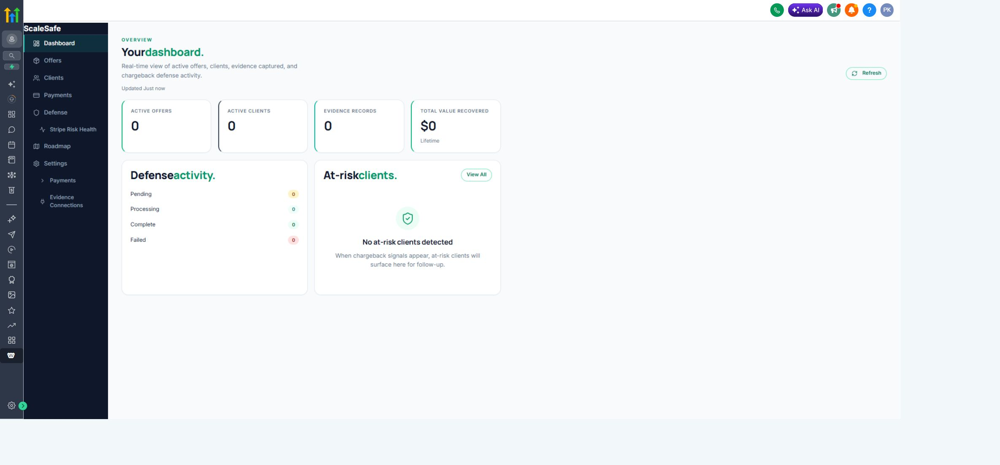
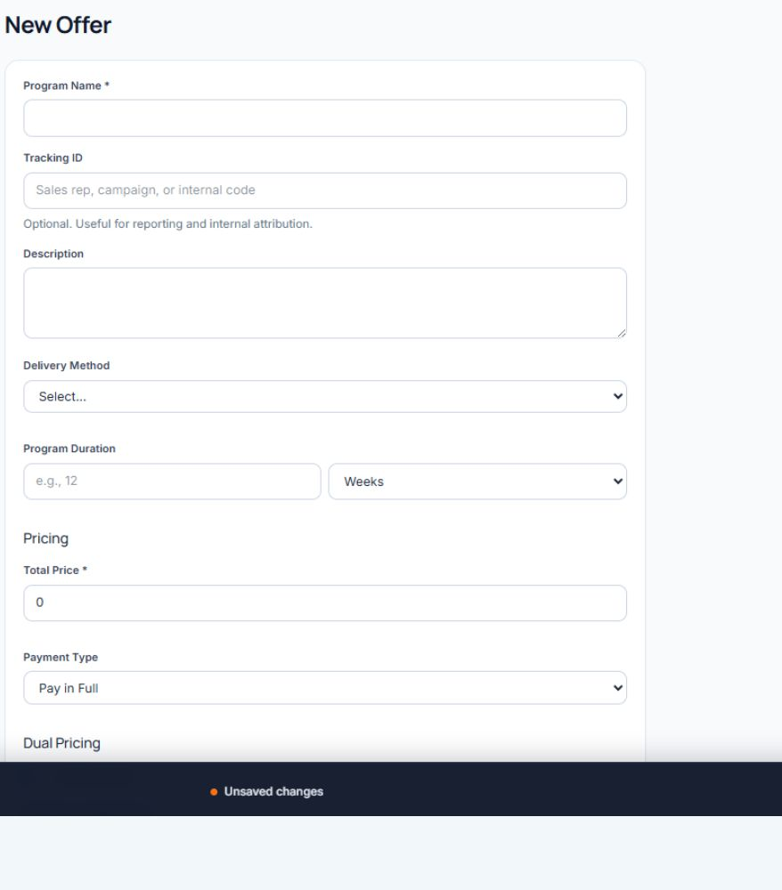

# ScaleSafe User Guide

Status: Working draft based on live product verification.

This guide is written for ScaleSafe merchants, operators, and support staff. It documents what the product actually does in the live test account. Screenshots and instructions are added only after the related workflow is observed or tested.

## Guide Sections

1. [Getting Started](#getting-started)
2. [Dashboard](#dashboard)
3. [Offers](#offers)
4. [Clients](#clients)
5. [Payments](#payments)
6. [Evidence](#evidence)
7. [Defense](#defense)
8. [Stripe Risk Health](#stripe-risk-health)
9. [Settings and Integrations](#settings-and-integrations)
10. [Workflow Reference](WORKFLOW_REFERENCE.md)
11. [Frequently Asked Questions](FAQ.md)
12. [Installation Guide](INSTALLATION_GUIDE.md)
13. [Troubleshooting](TROUBLESHOOTING.md)
14. [Reviewer Test Script](REVIEWER_TEST_SCRIPT.md)
15. [Reviewer Screenshot Manifest](REVIEWER_ASSET_MANIFEST.md)
16. [Screenshot Catalog](SCREENSHOT_CATALOG_2026-07-17.md)
17. [Reviewer Snapshot Inventory](REVIEWER_SNAPSHOT_INVENTORY.md) (operator reference)

Marketplace permission explanations and the scope-video runbook are maintained in [GoHighLevel Marketplace Scope Explanations](../GHL_MARKETPLACE_SCOPE_EXPLANATIONS.md).

## Getting Started

ScaleSafe opens inside the merchant's GoHighLevel sub-account. The ScaleSafe navigation includes Dashboard, Offers, Clients, Payments, Defense, Stripe Risk Health, Roadmap, Settings, and Evidence Connections.

Use the [Installation Guide](INSTALLATION_GUIDE.md) for the location-bound Marketplace, Merchant Setup, processor, Provisioning Health, and smoke-test sequence. Processor credentials, secrets, and production settings are never shown in this guide.

## Dashboard

The Dashboard provides an operational summary of the merchant account.

The verified dashboard currently shows:

- Active offers and clients.
- Total evidence records.
- Recorded value recovered.
- Urgent dispute-deadline warnings.
- Open disputes and their current submission state.
- Pulse check-ins that require merchant follow-up.
- Defense packet activity.
- At-risk clients.

### Recommended Daily Review

1. Check urgent dispute warnings first.
2. Review pulse responses marked as needing attention.
3. Review packet-ready disputes that have not been submitted.
4. Review at-risk clients and follow-up items.
5. Open Payments or Clients when more detail is needed.

## Offers

The Offers page is the merchant's catalog of enrollment and checkout experiences.

The verified list view includes:

- Offer name and delivery type.
- Tracking ID.
- Price and payment structure.
- Assigned processor.
- Active, archived, or quick-checkout status.
- Enrollment or checkout link.
- Copy, Send, Edit, Clone, and Archive actions.

The offer builder includes program identity, delivery method and duration, pricing, payment type, dual pricing, checkout add-ons, refund policy, full-enrollment or quick-checkout experience, bot protection, pulse cadence, clickwrap clauses, checkout channel, processor routing, connected delivery, and up to eight milestones.

Use **Clone** when a merchant wants a materially different version of a live offer. Existing enrollments keep the terms and payment structure captured when they were created; changing an offer does not rewrite a client's signed history.

Offer creation and checkout behavior still require a controlled workflow test before this guide documents every field.

## Clients

The Clients page supports name/email search, Active/Archive/All views, and status filtering. A client profile contains six working areas:

1. **Overview:** contact-level evidence readiness, recent activity, notes, and account summary.
2. **Programs:** one card per enrollment, including enrollment dates, payment progress, processor IDs, delivery type, milestones, pulse cadence, and supported program actions.
3. **Payments:** payment method summary and payment progress grouped by program.
4. **Evidence:** a filterable timeline of consent, payment, delivery, engagement, communication, refund, cancellation, and connected-platform records.
5. **Messages:** inbound and outbound GHL communication history with timestamp, channel, direction, source, and message type.
6. **Files:** downloadable enrollment packets and signed milestone records.

The profile header also provides **Add Note**, **Send Message**, **Send Offer**, **Quick Manual Sale**, and **Assign Offer**. These actions change merchant or client state and should be used only for the intended client.

**Send Message** carries the selected enrollment when one defensible program is chosen. ScaleSafe may select the sole eligible enrollment; when several programs are eligible, the merchant must choose. Notes remain intentionally client-level unless they are created from an enrollment-specific workflow.

These enrollment actions are intentionally different:

- **Send Offer:** sends a selected offer through the configured GHL email or SMS workflow so the client can enroll and pay.
- **Quick Manual Sale:** collects payment first. With an offer selected, ScaleSafe creates a paid-pending enrollment and can send the consent-only enrollment packet afterward. Whop opens its hosted checkout inside the QMS modal.
- **Assign Offer:** directly enrolls the client without payment or consent pages. Use it only when the merchant has a defensible reason to record an externally handled or no-payment enrollment.
- **Client-level payment only:** QMS without an offer records an unassigned payment and sends no enrollment packet or welcome email.

The readiness score shown on Overview is a contact-level evidence indicator. It is not a prediction that a chargeback will be won.

## Payments

The Payments workspace has three views:

- **All Payments:** search and filter the ledger by tracking ID, processor, billing type, status, and date.
- **Clients:** review total charged, total refunded, last payment, and open a client's payment-management page.
- **Reconciliation:** identify records that make processor truth difficult to prove, including missing processor/subscription IDs, overdue billing, duplicates, unassigned payments, and recent failures.

The payment ledger records the date, client, program, tracking ID, billing type, processor, amount, status, source, and processor transaction ID. Recurring program views also show payment number, first and last payment dates, next billing, subscription ID, and the linked payment method when available.

Refund, saved-method charge, pause, resume, cancel, and manual NMI import controls are processor-sensitive actions. The available action depends on the processor and whether ScaleSafe has the required processor payment or subscription identifier.

Reconciliation findings are operational warnings. They do not automatically modify processor or enrollment state.

## Evidence

Evidence is collected throughout the client relationship. The verified timeline can filter:

- Consent and enrollment payment.
- Sessions, attendance, appointments, and external sessions.
- Modules, courses, assignments, milestones, and milestone sign-off.
- Pulse check-ins and service access.
- Payment confirmations, failures, refunds, cancellations, and subscription changes.
- Communications, invoices, delivered resources, and approved custom events.

Each row shows whether it is linked to a specific program. **Linked** evidence may support that enrollment. **Link to Program** means ScaleSafe captured the activity at the client level but has not safely assigned it to one exact enrollment.

Unlinked activity remains visible for merchant context, but it should not be treated as defense-ready evidence for an unrelated program. ScaleSafe must not guess the newest enrollment when more than one program could match.

A scheduled appointment is engagement evidence. An attended or completed appointment is stronger service-delivery evidence.

## Defense

The Defense workspace tracks cases by status and shows total cases, wins, win rate, and recorded value recovered.

For each case, the merchant can review:

- Disputed amount and reason code.
- Response deadline.
- Packet state: pending submission, submitted, needs review, complete, won, lost, or expired as applicable.
- Generated letter and PDF.
- Evidence exhibits.
- Letter version history.
- Submission and outcome state.

The deadline displayed by ScaleSafe may be initialized from the card network's maximum window. The processor can require an earlier deadline, so the merchant must enter the actual deadline shown by the processor.

**Needs Review** is a safety state. It can mean the transaction was not tied to one exact enrollment, required evidence was missing, or an AI draft was unavailable. A Needs Review packet must be read and corrected before submission.

Compiling a packet, submitting it to a processor, marking it submitted, and recording the bank's outcome are separate actions. ScaleSafe does not control the bank's decision.

## Stripe Risk Health

The Stripe Risk Health page reads connected Stripe data and displays:

- Thirty-day dispute rate.
- Early fraud warnings.
- Dispute recovery rate.
- Evidence completeness.
- Open dispute exposure.
- Thirty-day transaction count.
- Visa and Mastercard monitoring status.
- Active disputes and defense history.

Sandbox and test-heavy accounts can produce unrealistic rates. Treat the page as an operational view of the connected account, not a prediction or card-network determination.

Live regression on July 15 confirmed that this page reads the Stripe snapshot and renders the normalized audit response. Test-heavy sandbox rates remain intentionally unrealistic and should be identified as test data in demonstrations.

## Settings and Integrations

Merchant Settings contains business information, the enrollment-funnel URL, default processor, evidence modules, GHL activity status, engagement tracking, dunning configuration, workflow webhook setup, provisioning health, and disengagement thresholds.

**Provisioning Health** verifies the merchant record, GHL OAuth connection, workflow authentication, processors, ScaleSafe custom fields/values, trigger subscriptions, reminders, and pulse readiness. A warning should be investigated; it does not always mean checkout is blocked.

Payment Settings contains processor-specific configuration for NMI, Stripe, Whop, and the deferred FanBasis channel. NMI supports named MID routes and an official webhook configuration. Stripe includes ACH setup guidance and a link to Stripe's dispute-prevention settings. Whop is a hosted checkout channel and exposes only actions supported by Whop identifiers.

Evidence Connections currently shows native GHL Fulfillment, Zoom, the universal Custom Software API, and the staged integration catalog. GHL and external events publish as enrollment evidence only after ScaleSafe resolves one defensible program match.

Live regression on July 15 confirmed that connector event history loads with source state, matching method, and client/program target. Zoom is connected but remains uncertified for attendance until one real non-host participant event publishes to the correct enrollment.

Settings changes, credentials, webhook secrets, processor tests, and cleanup actions should be performed only by an authorized operator.

## Screenshot Policy

- Working screenshots may use designated test clients.
- Public website screenshots must use sanitized test fixtures.
- Never show full card details, bank details, API keys, webhook secrets, or access tokens.
- Replace screenshots after material UI changes.
